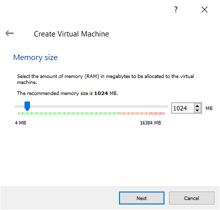
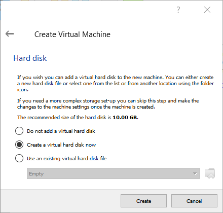
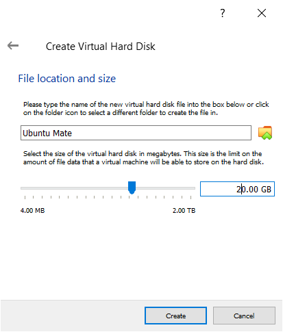

# Instalacion y configuracion de Ubuntu en maquina virtual (Windows) #

Primero, leer un poco sobre la definicion de máquina virtual, para contextualizarse. 

[Máquinas virtuales: qué son, cómo funcionan y cómo utilizarlas](https://www.xataka.com/especiales/maquinas-virtuales-que-son-como-funcionan-y-como-utilizarlas).

## Proceso de instalación ##

Para instalar una maquina virtual en Windows, se debe seguir los siguientes pasos:

#### 1. Descargar Virtual Box. ####
Ir a la página de descargas de virtual box y descargar la última version, seleccionando la opción ```Windows host```.

[URL Virtual Box](https://www.virtualbox.org/wiki/Downloads)
#### 2. Instalar Virtual Box.

El proceso de instalación es similar a cualquier otro programa.

#### 3. Descargar la imagen de ubuntu 
Recomendamos usar la siguiente distribucion, por ser una de las mas livianas en la interfáz gráfica:
[Ubuntu Mate](http://cdimage.ubuntu.com/ubuntu-mate/releases/18.04/release/ubuntu-mate-18.04.3-desktop-amd64.iso).

Igualmente cualquier otra distribución es válida y los pasos de instalación son similares.

#### 4. Instalar la imagen en la maquina virtual. ####

Una vez se tenga instalado el programa Virtual Box, al abrirlo tendremos una interfáz como esta:


En la sección de la izquierda se observarán todas las máquinas virtuales, pero al momento no tenemos ninguna.

Seleccionamos la opción "New" o "Nuevo":


Y nos abrirá un dialogo similar al siguiente, donde podremos asignar un nombre a nuestra máquina virtual (Si seleccionamos el nombre asociado a la distribución, en este caso "Ubuntu",automáticamente nos configura el tipo y la version):


Recomendamos asignar el nombre tal como se mostró en el dialogo anterior y procedemos con el boton "Next" o "Siguiente". Se abrirá el siguiente diálogo:


Dependiendo de la cantidad de RAM presente en el equipo, se puede asingar una parte para la Máquina Virtual (Virtual Machine o VM). Recomendamos asignarle un tamaño no inferior a los 2048 MB. Igualmente este valor puede modificarse mas adelante según la necesidad (mostraremos el cómo mas adelante).

Procedemos luego con el botón "Next" o "Siguiente", y en el siguiente diálogo, dejamos la opción que se encuentra seleccionada sin hacer ninguna modificación.



Seleccionamos en botón "Create" o "Crear".



Dejamos la opción que se encuentra seleccionada en "VDI (VirtualBox Disk Image)". Y nuevamente seleccionamos el botón "Next" o "Siguiente".


Dejamos la opción que se encuentra seleccionada en Dynamically allocated. Y seleccionamos el botón "Next" o "Siguiente".


Dependiendo de la cantidad de memoria que se tenga disponible en el equipo (Cantidad de espacio disponible en disco duro), podremos seleccionar en este paso la cantidad de disco que le asignaremos a nuestra VM. Recomendamos asignar un espacio no inferior a 20 GB.



Seleccionamos el botón "Create" o "Crear". Y ya se puede visualizar en el panel izquierdo como se muestra a continuación:


En este punto solo hemos acondicionado los recursos necesarios para ejecutar nuestra VM, pero esta todavia no existe, porque debe configurarse como si se tratara de un equipo independiente.


<!-- 
El cual nos pedira seleccionar el archivo ```.iso``` correspondiente a la imagen que descargamos previamente -->